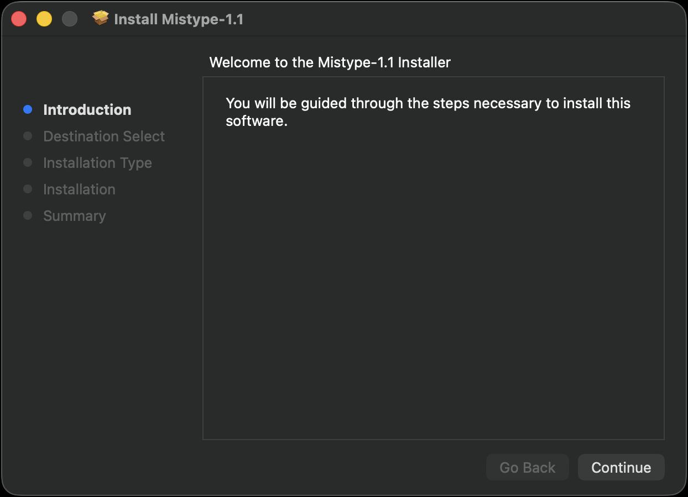
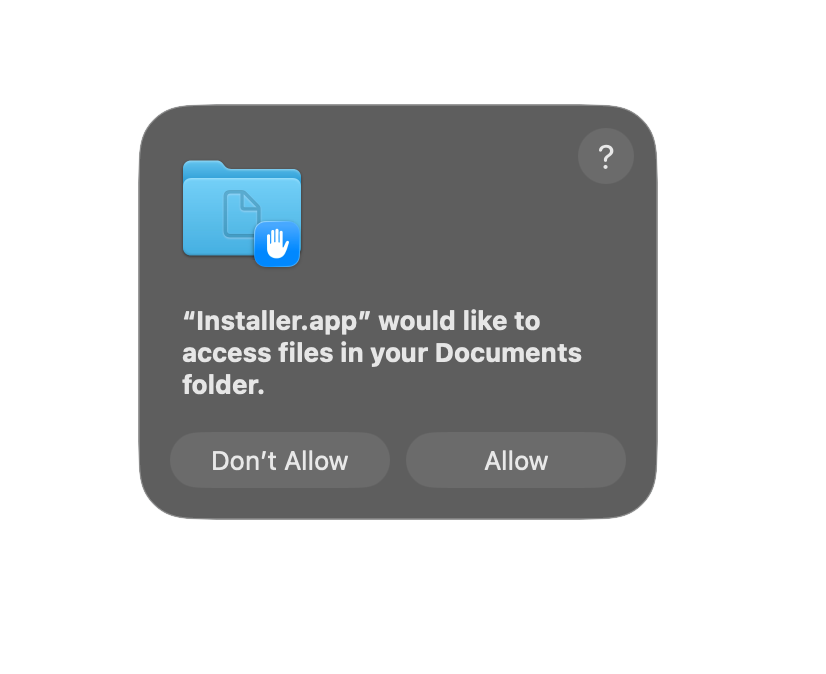
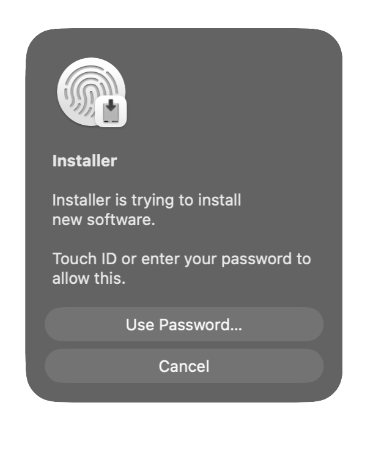
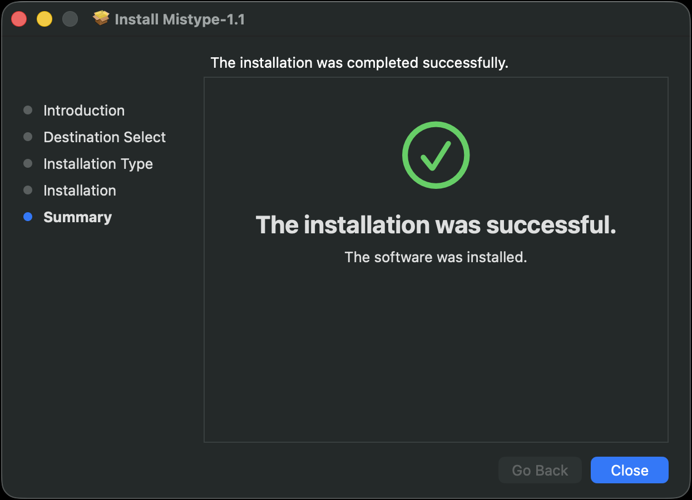
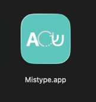
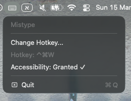

# Mistype | אפליקציה להפיכת שפה למק

**Typed in the wrong language? Fix it in one click.**

A tiny macOS menu-bar app that solves a familiar problem: you typed a whole sentence in Hebrew while your keyboard was set to English, or vice versa — and now you have to delete everything and retype it.

With Mistype, you select the text, press a hotkey — and the text is automatically converted to the correct language and pasted back in place.

---

## How to use

1. Select the text you want to convert
2. Press the hotkey (default: **Cmd+Shift+H**)
3. The converted text replaces the original automatically

You can change the hotkey via the Mistype icon in the menu bar → Preferences.

---

## Installation / התקנה

### קישור להורדה

[**הורד את Mistype 1.1**](https://github.com/ipintush/Mistype/releases/tag/v1.1)

---

### התקנה דרך הטרמינל

```bash
brew tap ipintush/mistype && brew install --cask mistype
```

---

### התקנה ידנית (PKG)

לאחר ההורדה, פתח את קובץ ה-PKG ולך לפי ההוראות:



אשר את הבקשה לגישה לתיקיית המסמכים ואת אימות ה-Touch ID / סיסמה:

<p float="left">
  
  
</p>

לאחר ההתקנה תראו את המסך הבא:



במידת הצורך, היכנס להגדרות ← פרטיות ואבטחה ואשר את ההתקנה שם למטה.

---

### לאחר ההתקנה

העבר את `Mistype.app` לתיקיית האפליקציות:



לאחר הפעלת האפליקציה תראה אייקון מקלדת בשורת האייקונים העליונה. לחיצה עליו מאפשרת לשנות את קיצור הדרך.

במידה וזה לא עובד, בדוק שהרשאת הנגישות פעילה — בשורה Accessibility צריך להופיע **Granted ✓**:



---

## Permissions

Mistype requires **Accessibility** permission to read and replace text in any app.
On first launch a prompt will appear — approve it in System Settings.

---

## Requirements

- macOS 13 Ventura or later
- Apple Silicon or Intel Mac

---

## Changelog

See [CHANGELOG.md](CHANGELOG.md).

---

Developed by [Studio Pik Media](https://www.pikmediagroup.com)
